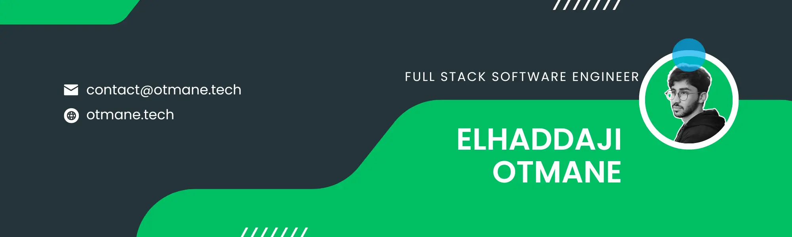

<h1 align="center">Otmane Elhaddaji - Expert Web Developer</h1>
 

<h2 align="center">About Me</h2>

 I'm Otmane, an accomplished web developer with a strong background in full-stack development. I've collaborated with prominent companies in the tech industry, honing my skills and expertise. As a recent graduate of a prestigious coding bootcamp, I've acquired the knowledge to craft dynamic web applications. I'm driven by a passion for tackling complex challenges with innovative solutions. For project discussions or questions, please contact me via email.

 

  

  
  
  
  

  
  
  

<h2 align="left">My Learning Journey</h2>
<ul>
    <li>☁️ <strong>AWS Certifications</strong>: <strong>AWS Certified Solutions Architect – Associate</strong> — designing and implementing scalable, secure, and robust solutions on AWS.</li>
    <li>🏅 <strong>Credly Credential</strong>: 
      
    </li>
    <li>🌐 <strong>Microsoft Azure</strong>: Exploring Microsoft Azure to gain a broader understanding of multi-cloud strategies and services.</li>
    <li>📝 <strong>Tech Blogging</strong>: Regularly sharing my learning experiences and insights on tech trends on my <a href="https://webnexa.net/blog" title="Visit Elhaddaji Otmane's tech blog">tech blog</a>.</li>
</ul>

### Connect with me:

[//]: # ""
[//]: # ""
[//]: # ""

<h3 align="left">Languages and Tools:</h3>

       
                                 

<h3 align="left">Support My Work:</h3>

  

  

  
  
  

  

